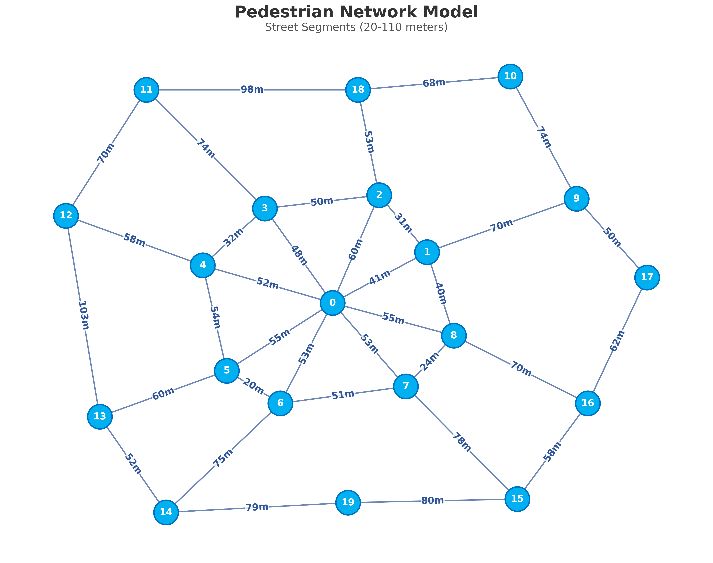
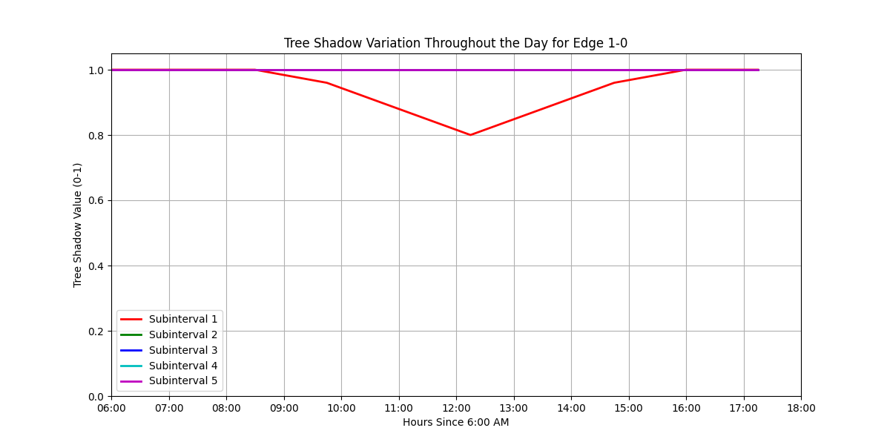
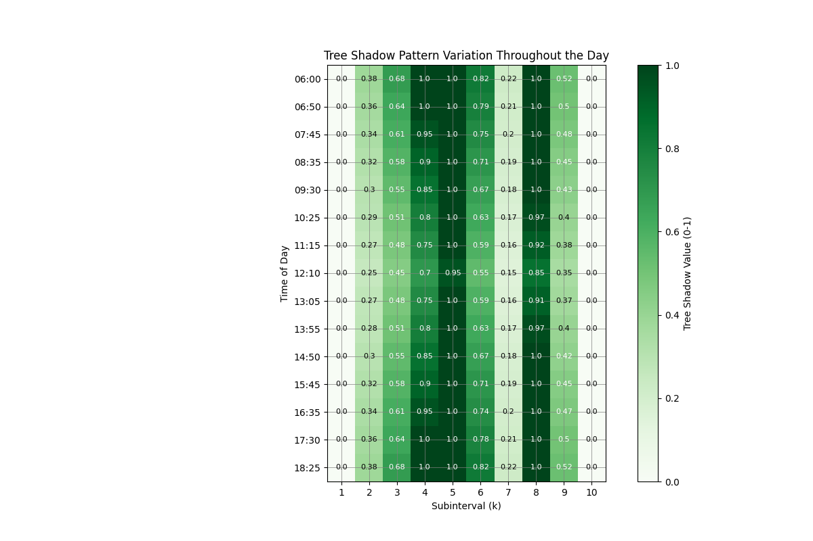
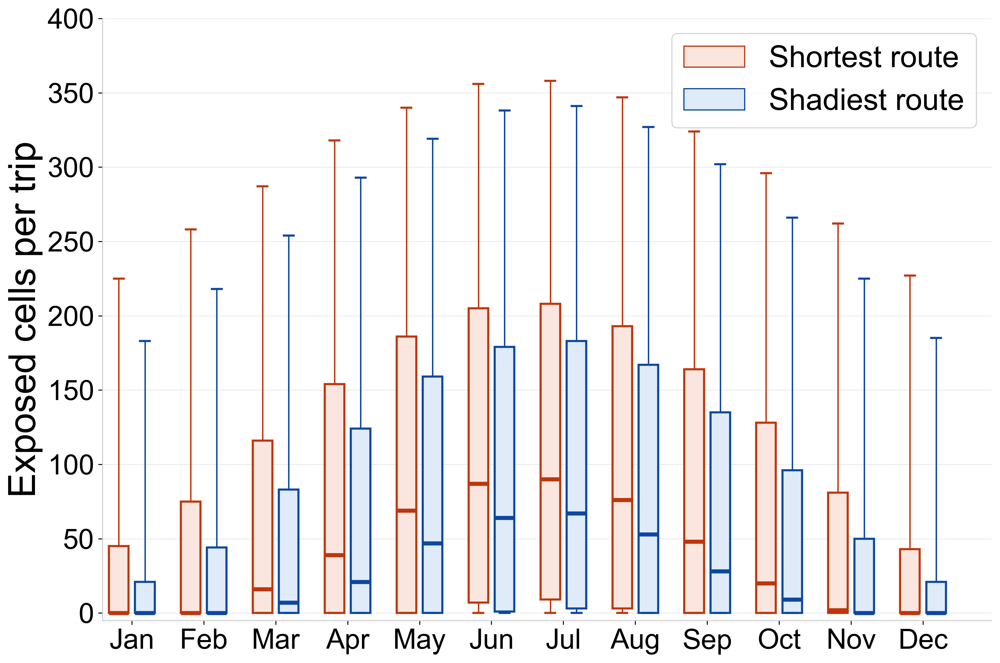

# Sunlight City: Solar-Aware Urban Routing

An end-to-end research prototype for finding walking routes that balance travel distance with solar exposure. The system combines a Unity 3D city model, minute-level solar-position simulation, road-network extraction, multi-objective route search, and a web dashboard.

> 中文简介：这是一个面向城市步行舒适度的研究项目。系统根据建筑与树木阴影、太阳轨迹和道路网络，为不同月份与时段计算“更短”与“更阴凉”的 Pareto 最优路线，并通过网页与 Unity 场景展示结果。

[Live web demo](https://sunlight-city-blush.vercel.app/) · [Shared research archive](https://drive.google.com/drive/folders/1nhBU1dE_6kBZuLyCUtab-dweCUx0I9hL) · [Collaborative front-end repository](https://github.com/yixuanyang123/SunlightCity)



## What the project does

1. Generates solar azimuth and elevation for every minute of a year.
2. Loads compact binary solar data into Unity to animate the sun and calculate time-dependent building/tree shadows.
3. Extracts a directed road graph from the 3D city model and associates each edge with exposure measurements.
4. Runs a label-setting, multi-objective routing algorithm to identify distance–exposure trade-offs.
5. Aggregates monthly results and produces research figures.
6. Presents routes and urban-comfort indicators through a Next.js/FastAPI application.

## System components

| Area | Implementation | Key files |
|---|---|---|
| Solar simulation | Python, pvlib, NumPy, Unity/C# | `src/solar/` |
| Road graph | Unity/C# extraction and Python binary merging | `src/road_network/` |
| Multi-objective routing | Python, NetworkX, PostgreSQL | `src/routing/` |
| Analysis | NumPy and Matplotlib | `src/visualization/` |
| Web experience | Next.js, React, TypeScript, FastAPI | `frontend/app/` |
| Research notebooks | Jupyter/Colab | `notebooks/` |

## Repository structure

```text
.
├── src/
│   ├── solar/           # solar-position generation and Unity loaders
│   ├── road_network/    # graph extraction and binary model merging
│   ├── routing/         # Pareto label-setting and result enrichment
│   └── visualization/   # scripts used for research figures
├── data/sample/         # small, inspectable sample inputs
├── notebooks/           # exploratory routing notebooks (outputs removed)
├── frontend/app/        # web dashboard and API demo
└── docs/assets/         # representative result visualizations
```

## Representative outputs

| Network and shade data | Temporal tree-shadow pattern |
|---|---|
|  |  |



## Quick start

### Generate solar data

```bash
python -m venv .venv
source .venv/bin/activate
pip install -r requirements.txt
python src/solar/generate_solar_data.py --cities Manhattan --years 2026
```

The generator writes the `SLRD` binary format expected by the Unity loaders in `src/solar/`.

### Run the web demo locally

```bash
cd frontend/app
npm install
npm run dev
```

Open `http://localhost:3000`. See `frontend/app/README.md` for the optional FastAPI/PostgreSQL back end.

### Run the routing pipeline

The full experiment needs the large OD tables, graph database, and monthly Pareto folders stored in the shared archive. Configure database access through environment variables—never commit credentials:

```bash
export DB_HOST=localhost
export DB_PORT=5432
export DB_DATABASE=postgres
export DB_USER=postgres
export DB_PASSWORD='your-password'
python src/routing/final_label_setting_v26_05.py
```

The original workflow runs one month at a time; update `DATE_SELECTION` and `OUTPUT_DIR` in the script for each experiment.

## Data and large assets

The source archive is more than 10 GB and contains Unity packages, 3D models, monthly routing results, SQL backups, presentations, and videos. Those artifacts are intentionally not copied into Git because many exceed GitHub's 100 MB per-file limit and some contain operational or third-party material. The repository includes small samples and links to the [shared archive](https://drive.google.com/drive/folders/1nhBU1dE_6kBZuLyCUtab-dweCUx0I9hL) instead.

Not published here:

- database backups and full OD/result tables;
- Unity packages and large 3D models;
- meeting minutes;
- third-party research PDFs;
- raw demo videos and presentation drafts.

## Security and provenance

- Database credentials found in research scripts were replaced with environment variables before publication.
- Local `.env` files, virtual environments, caches, and generated outputs are excluded.
- This is a curated portfolio snapshot of a collaborative research project. The web application is also attributed to its collaborative source repository above.
- No open-source license is granted by this snapshot; contact the project contributors before reusing project code or assets.

## Future work

- Package the routing pipeline as a reproducible CLI with configuration files.
- Publish a small anonymized benchmark dataset and automated tests.
- Connect the web map directly to generated Pareto routes.
- Add performance comparisons across cities, seasons, and time windows.

